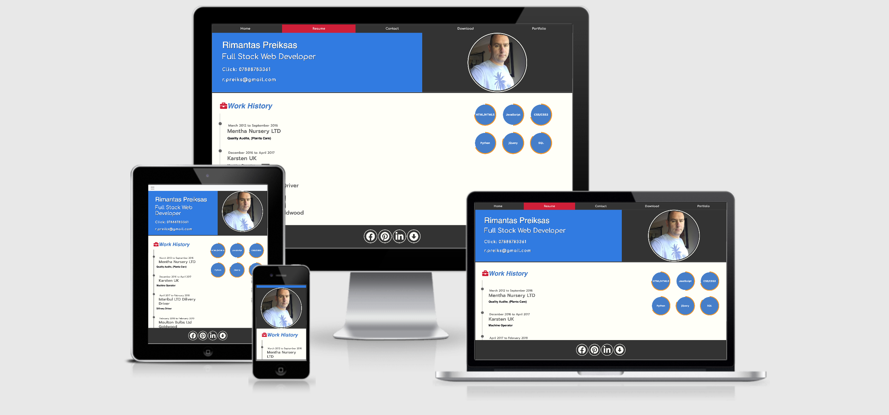

# Full Stack Web Developer 

This website is my first milestone project for Code Institute, I will be using this website for my own presentation. The website is very simple, my goal was to display easily understandable information, for my potential employers or customers. The website was built using the Bootstrap v4.4.1 framework. 
Hosted on [GitHub Pages](https://rimantascode.github.io/milestone-profile2/)
Repository on [GitHub](https://github.com/rimantascode/milestone-profile2)

## License

The project is shared for use with the [GNU General Public License v3](https://github.com/Pattern-Projects/oireachtas-ifd-project/blob/master/LICENSE)

>   This program is free software: you can redistribute it and/or modify
    it under the terms of the GNU General Public License as published by
    the Free Software Foundation, either version 3 of the License, or
    (at your option) any later version.

## UX



### Users 
Expected users of the website my potential employers or clients.

### Design

- Colour scheme consists of few colours, was used website to blend the colors.
   (https://meyerweb.com/eric/tools/color-blend/#:::hex)
    -  `#fffff7`
    -  `#d01b33`
    -  `#2b78e4`
    -  `#333333`
    -  `#d09233`
    -  `#666666`
    -  `#f89808`
    -  `#dc3545` Bottstrap card class bg-danger
    
    
-  font used throughout the website
    - font-family: 'Comfortaa', 'Prompt','Roboto', sans-serif;

### Mockups
The website consists from 4 pages index.html, conttact.html,resume.html,portfolio.html. Download section is stright forward, to download the the cv. I did a mockups for 3 pages in the beginning, and then dicided to build 2 more pages. 
- [Mockup](documentation/full-stack-web-developer-milestone.pdf)  


## Features

Features planned, implemented and outlined for later development 

### Planned Features
- Documentation - ReadMe File, Licence & Mockups
- Colour Scheme
- custom logo
- Favicon
- Bootstrap - HTML, CSS Framework
    - Grid System - Columns and Rows
    - Cards
    - Navbar
    - Pegination
- Responsive design - Mobile First
- UX elements
    - Animations
- Accesibility
- Git - Version Control System
- GitHub - Remote Repository
- Deployed - Hosted on Github Pages

### Existing Features
- Documentation - ReadMe File, Licence & Mockups
- Colour Scheme
- Bootstrap - HTML, CSS Framework
    - Grid System - Columns and Rows
    - Cards
    - Navbar
- Responsive design - Mobile First
- UX elements
    - Animations
- Accesibility
- Gitpod - Version Control System
- GitHub - Remote Repository
- Deployed - Hosted on Github Pages


### Features Left to Implement
- custom logo
 Bootstrap - HTML, CSS Framework
    - Pagination

## Technologies Used

This project makes use of:
- [HTML](https://developer.mozilla.org/en-US/docs/Web/HTML)
    - HTML for strucutre
- [CSS](https://developer.mozilla.org/en-US/docs/Web/CSS)
    - CSS for Styling
- [Google Chrome](https://www.google.com/chrome/)
    - Used for browser and dev tools
- [Mozilla Firefox](https://www.mozilla.org/en-US/firefox/new)
    - Used for browser
- [Google](https://www.google.com/)
    - **Google** was used for research.
- [Bootstrap](https://getbootstrap.com/)
    - HTML and CSS Framework from **Bootstrap**
- [Gitpod](https://www.gitpod.io/)
    - **Git** used for Version Control
- [GitHub](https://github.com/)
    - Repository hosted on **GitHub**
- [Github Pages](https://rimantascode.github.io/milestone-profile2/)
    - Website hosted on **Github Pages**
- [Am I Responsive](http://ami.responsivedesign.is)
    - Testing responsiveness of the website **Am I Responsive**
- [Balsamiq](https://balsamiq.cloud/)
    - used to make a mockup

## Testing
    Tested on Mozilla firefox, Opera, Google Chrome and Safari browsers looked good responsive design.
    sent few links to my friends and relatives, the feedbacks were good.


## Deployment

The project is hosted on [GitHub Pages](https://rimantascode.github.io/milestone-profile2/)

The process involved:
- Host a git repository on GitHub. Explained [here](https://help.github.com/en/articles/create-a-repo).
- The root folder contains README.md and index.html files
- On GitHub repository settings page move to GitHub Pages section
- Change source to master branch. (Or any desired branch)
- Provided link will be your projects home (index) page.
 
To deploy your own version of the website:
- Have git installed
- Visit the [repository](https://github.com/rimantascode/milestone-profile2)
- Click 'Clone or download' and copy the code for http
- Open a terminal in your root directory
- Type 'git clone ' followed by the code taken from github repository
    - ```https://github.com/rimantascode/milestone-profile2.git```
- When this completes you have your own version of the website
    - Feel free to make any changes to it
- The website can be run by opening one of the HTML files within a web browser
- Visit the link provided
- Your website with any made changes will appear
- Saved changes to the website will appear here after refreshing the page

The benefits of hosting your website on GitHub pages is that any pushed changes to your project will automatically update the website. Development branches can be created and merged to the master when complete.

It may take a moment for changes to appear on the hosted website.

## Credits
 - [w3schools](https://www.w3schools.com/css/css3_shadows.asp)
    - Box shadow was coppied and modified.
- [code Institute](https://code-institute-solutions.github.io/StudentExampleProjectGradeFive/)
    - used and idea of the pie diagram.
-  [readme](https://github.com/Pattern-Projects/oireachtas-ifd-project/tree/master)
    - used as I guidence for my own readme.md
- Work History style coppied and modified from Code Institute lessons
### Acknowledgements
Thank you inspiration, very usefull guidence and tips:

- Seun Owonikoko    @seun_mentor
- Code Institute